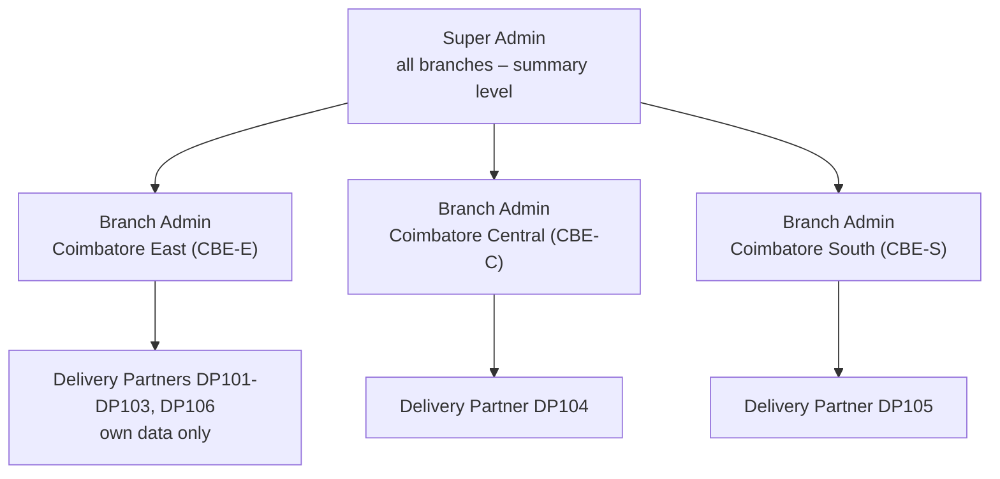
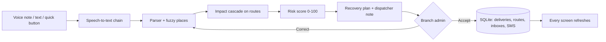

# Ripple – disruption-aware delivery operations

> Every disruption creates a ripple. Ripple shows how far it spreads – and how to stop it.

**Live demo:** <https://ripple-coimbatore.streamlit.app> – sign in as a branch admin on a laptop and as
a delivery partner on a phone (credentials below). Free hosting: if it says the app is asleep, wake it
and wait about a minute.

## The problem
A single accident, flood or flat tyre in a city like Coimbatore quietly breaks dozens of delivery
promises. Drivers phone the office, the dispatcher pieces together *where* it is and *which*
parcels are now late, and by the time anyone decides, the insulin for the hospital is an hour late
and the milk has spoiled. The information exists – it is just stuck in a driver's voice note.

## What Ripple does
| | Who | What happens |
|---|---|---|
| 1 | **Delivery partner** (phone) | Taps *Report a problem* and says it the way they talk: *"avinasi rd la accident, full block, rendu mani neram"*. |
| 2 | **AI** | Transcribes (Tamil/English/Tanglish), finds the place even when misspelled, works out every delivery that will be late, scores the risk and drafts a recovery plan – explained like a senior dispatcher would. |
| 3 | **Branch admin** (laptop or phone) | Sees the issue live on the map within seconds, reads the plan, taps **Accept**. |
| 4 | **Everyone** | Routes, ETAs and the backup van update instantly; each partner's phone gets its instructions; customer SMS are drafted. |

Demo numbers (2-hour accident on Avinashi Road): **9 deliveries on 3 vehicles hit → missed
deadlines 3 → 0, delay 855 → 154 min**, insulin for KMCH delivered by the backup van at 10:44
(deadline 11:30).

## Roles & access
The app opens on a sign-in page – nothing else (no menu, data, KPIs or map) is shown before login.
There are three levels; every account belongs to exactly one, and admins and partners to exactly one branch.



| Role | Pages after login |
|---|---|
| Super Admin | Overview · Branches · Branch Admins · Audit Log |
| Branch Admin | Command Center · Map & Operations · Delivery Partners (incl. *Add delivery partner*) · Deliveries · Disruptions & AI · History – **own branch only** |
| Delivery Partner | Today · My Deliveries · My Route · Report Issue · My History · Notifications – **own data only** |

### Permissions
Stored in the `roles`, `permissions` and `role_permissions` tables and checked in code
(`auth.require_permission`), not just by hiding buttons.

| Permission | Super Admin | Branch Admin | Delivery Partner |
|---|:-:|:-:|:-:|
| `manage_branches` – create, activate/deactivate branches | ✓ | | |
| `manage_branch_admins` – create, deactivate, reset password | ✓ | | |
| `view_all_branches` – summary KPIs per branch | ✓ | | |
| `view_audit_log` | ✓ | | |
| `reset_demo` | ✓ | | |
| `manage_partners` – add / deactivate partners of **own** branch | | ✓ | |
| `view_branch_ops` – map, partners, deliveries, issues of **own** branch | | ✓ | |
| `approve_recovery` – accept / correct / reject AI plans | | ✓ | |
| `log_issue` – log a problem heard by phone | | ✓ | |
| `report_issue` – voice / text report as **themselves** | | | ✓ |
| `view_own_deliveries` | | | ✓ |

### Demo credentials
For judges and this README only – they are never shown in the app.

| Role | Email / ID | Password |
|---|---|---|
| Super Admin (via *Super Admin access* on the sign-in page) | `superadmin@deport.in` | `Super@123` |
| Branch Admin – Coimbatore East | `east.admin@deport.in` (Divya Raman) | `Admin@123` |
| Branch Admin – Coimbatore Central | `central.admin@deport.in` (Suresh Kumar) | `Admin@123` |
| Branch Admin – Coimbatore South | `south.admin@deport.in` (Meena Sundar) | `Admin@123` |
| Delivery Partner | `DP101` … `DP106` or `dp101@deport.in` … (e.g. `DP102` = Karthik, `DP106` = Lakshmi, East's backup van) | `Partner@123` |

Emails and IDs are not case-sensitive and spaces are ignored (`dp102`, ` DP102 ` work).
Partners added by a branch admin get the next free ID (`DP107`, …) and a one-time password shown once.

### Ways to sign in
- **Email or ID + password**, with *Remember me* (7 days instead of 8 hours).
- **Login with OTP** – a 6-digit code to the account's phone, valid 5 minutes, 3 tries, resend after 30 s.
  Without an SMS provider (`SMS_API_KEY`), the code is shown on screen as a *Demo SMS*.
- **Forgot password?** – OTP to the phone, then a new password (8+ characters, a letter and a digit).
- **Continue with Google** – real Google sign-in through `st.login` when `[auth]` is configured in
  secrets (see `.streamlit/secrets.toml.example`); the Google email must belong to an existing,
  active account – accounts are never auto-created. Without it, a chooser labelled *Demo mode* lets you
  pick a demo account (hide it with `DEMO_MODE = "0"`).
- **Super Admin access** – a separate console sign-in; super admins cannot use the normal form and
  branch admins / partners cannot use the console.

### Security notes
- Passwords: PBKDF2-HMAC-SHA256, **200 000 iterations**, a random salt per account; plain passwords
  and OTPs are never stored or logged – only hashes (OTPs are salted hashes too).
- Sessions: a random token (`secrets.token_urlsafe`); the database keeps only its SHA-256 hash, an
  expiry and a revoked flag. Every page run re-validates it, so logout, deactivating an account or a
  branch, or expiry takes effect on the next click. *Remember me* keeps the token in a cookie
  (`ripple_session`); logout revokes it server-side and deletes the cookie.
- Lockout: 5 wrong passwords lock the account for 2 minutes. Deactivated accounts and accounts of an
  inactive branch cannot sign in.
- Audit log: logins, failed logins, lockouts, OTP use, password resets and every admin action
  (branch / admin / partner created, activated, deactivated) are written to `audit_log`.

### How data is isolated
Role, `branch_id` and `dp_id` come **only from the validated session** (or the API session token) –
never from a form, URL or selectbox. Scoping is enforced in the core code, not only in the UI:
- every operational table (partners, vehicles, deliveries, issues, disruptions, messages, events)
  has a `branch_id`; branch-admin reads go through `store.*(branch_id=…)`, and the impact model and
  recommender run on a branch-only snapshot, so a plan in East can only use East's vehicles and backups;
- writes check the branch in SQL (`WHERE … AND branch_id = ?`) and raise `PermissionError` across
  branches – accepting, rejecting or editing another branch's issue fails even if called directly;
- partner pages read and write exclusively through `modules/partner_scope.py`, whose functions take the
  session's `(dp_id, branch_id)` and touch only the partner's own rows (deliveries joined on their own
  vehicle, own messages, own reports); *Delivered* on someone else's parcel raises `PermissionError`;
- the Super Admin sees branch summaries (counts and KPIs), not partner phone numbers or deliveries;
- every page calls `require_role(...)` first, so a page opened directly by the wrong role shows
  "Access denied".

## 3-minute demo script
1. **Sign-in page** – no data visible; note *Login with OTP*, *Continue with Google*, *Super Admin access*.
2. **Super Admin** (`superadmin@deport.in`, via *Super Admin access*) → *Overview*: 3 branches with their
   admin, partners, deliveries, delays and open issues side by side → *Branches* / *Branch Admins* (create a branch or
   an admin, deactivate one) → *Audit Log* → *Logout*.
3. **Phone:** sign in as **`DP102`** (Karthik, East) → *Report Issue* → record
   *"Avinashi road la accident, full block, rendu mani neram aagum"* (or type it) → *Check* →
   "Accident · Avinashi Road · about 2 h · critical" → **Send to manager** → *Logout*.
4. **Laptop:** sign in as **`central.admin@deport.in`** – Central sees nothing of it (other branch) → *Logout*.
5. Sign in as **`east.admin@deport.in`** → *Command Center* shows "1 issue waiting for your decision" and the
   critical deliveries (KMCH insulin, FreshMart dairy) → *Map & Operations* (blocked road, ripple) →
   *Disruptions & AI* (voice note, transcript, impact: missed deadlines 3 → 0) → **Accept plan** →
   KPIs update ("Deadlines saved: 3"). Optional: *Delivery Partners* → *Add delivery partner* → `DP107`
   with a one-time password.
6. **Phone:** sign in as **`DP102`** → *Today* shows the new instructions (avoid Avinashi Road, take the
   Peelamedu–Hope College stretch, hand the dairy to Lakshmi); *Notifications* and *My Route* updated.
   Bonus: **`DP106`** (Lakshmi, East's backup van) now has the insulin and dairy pickups.
7. Bonus: *Login with OTP* as `DP102` (demo SMS code on screen), or *Forgot password?*.
8. Before the next run: Super Admin → sidebar → *Reset demo data*.

## Features
**Super Admin**
- *Overview*: one card per branch (admin, partners, deliveries, delivered, delayed, critical, open issues) and a deliveries-by-branch chart
- *Branches*: create a branch, activate / deactivate it
- *Branch Admins*: create an admin for a branch (generated temporary password), deactivate, reset password
- *Audit Log*: who did what, when, in which branch

**Branch Admin** (own branch only)
- *Command Center*: KPI tiles, decision alert, deliveries at risk, delivery partner status, latest activity
- *Map & Operations*: live map – tap a delivery partner → popup + detail panel (phone, shift, stops)
- *Delivery Partners*: spreadsheet with search, status filter, row selection and CSV download;
  *Add delivery partner* (next DP ID, free vehicle, one-time password) and an *Account active* toggle
- *Disruptions & AI*: voice-note player, transcript, AI understanding + confidence, impact, dispatcher
  note, actions with reasons, **Accept / Correct it / Reject**, risk table, ripple map, dependency graph,
  message preview, *Log an issue* for problems heard by phone
- *Deliveries*: every order with changes (reassigned / rerouted / re-attempt) and the customer SMS outbox
- *History*: decided issues, activity log, AI status line

**Delivery Partner (phone first)**
- *Today*: "Hi Karthik 👋", new instructions with *Got it*, progress, next stop with *Delivered* and *Call*
- *My Deliveries*: all own stops with *Done*
- *My Route*: own route on a map, roads in order and ETAs
- *Report Issue*: quick button, voice note or text; "We understood …" check before sending; if no place
  is recognised, tap one of *your own* roads
- *My History*: own reports with status, completed deliveries
- *Notifications*: instructions from the branch admin, mark as read

**AI that degrades gracefully**
| Step | With a key | Without any key |
|---|---|---|
| Voice → text | Groq Whisper (Tamil/Tanglish) or Gemini | free Google web speech → else type one line |
| Text → problem | LLM extraction, validated | rules + Tanglish/Tamil keywords + spoken numbers |
| Place matching | – | fuzzy matching of 41 places, aliases and Tamil names (always on) |
| Plan | same engine | impact cascade + weighted risk + recommender |
| Explanation | LLM polishes the dispatcher note (numbers verified) | template note |

## How it works

- **Impact:** a delivery is hit if its vehicle's route reaches the blocked road before the stop;
  delay = detour/wait for the severity + a cascade per later stop; several disruptions add up.
- **Risk:** 45 × deadline pressure + 30 × priority (medical > perishable > express > standard)
  + 10 × closeness to the block + 15 × severity → Critical ≥ 75, High ≥ 50, Medium ≥ 25.
- **Plan:** urgent medical/perishable → nearest idle backup van (if it beats the deadline);
  other Critical/High → reroute via the best open road (never through another blocked road);
  Medium → prioritise; Low → notify the customer.
- **Live:** every write bumps a version number; each open screen checks it every 4 s and refreshes.

## Run it
```bash
pip install -r requirements.txt
streamlit run app.py                 # app on http://localhost:8501
uvicorn api.main:app --reload        # mobile API, docs on http://localhost:8000/docs
python -m pytest -q                  # all tests, no internet or keys needed
```
**Optional secrets:** copy `.streamlit/secrets.toml.example` to `.streamlit/secrets.toml` (git-ignored;
on Streamlit Cloud paste the same lines under *App → Settings → Secrets*):
- `GROQ_API_KEY` – free key at <https://console.groq.com/keys>, recommended for voice;
- `[auth]` + `[auth.google]` – real Google sign-in (OIDC client ID/secret, redirect URI; needs `Authlib`);
- `SMS_API_KEY` – stops showing OTP codes on screen; `DEMO_MODE = "0"` hides the demo Google chooser;
- `TEAM_NAME` – footer of the sign-in page.

The database (`data/ripple.db`) is created and seeded on first run; a database from the earlier
2-role version is migrated in place (branches added, old manager → East's branch admin).

*Remember me* uses Streamlit's own cookie reading (`st.context.cookies`) plus a tiny script to set the
cookie, so no extra cookie-manager package is needed.

## Mobile app plan
The Streamlit app is already phone-first (one-thumb buttons, no hover-only information,
light/dark theme). For a native Android/iOS app (Flutter or React Native), all business logic is in
`modules/` (no UI code) and exposed by `api/main.py` with the same accounts and sessions:
`POST /login {identifier, password, super_console?}` returns a session token (stored hashed, revoked by
`POST /logout`). Partner apps use `/me`, `/me/deliveries`, `/me/route`, `/me/messages`,
`/me/issues/voice`, `/me/deliveries/{id}/delivered` – the partner and branch come only from the token.
Branch-admin apps use `/kpis`, `/map`, `/partners`, `/issues`, `/issues/{id}/accept`, … for their own
branch; the Super Admin gets `/branches` (summaries). The native app and the web console share one
database, so they can run side by side.

## Project structure
```
app.py                 sign-in first, then role-only navigation + sidebar (user, role, branch, Logout)
views/login.py         sign-in page: password, OTP, forgot password, Google, Super Admin console
views/super/           overview · branches · admins · audit
views/manager/         branch admin: command_center · map_ops · partners · deliveries · disruptions · history
views/partner/         today · my_deliveries · my_route · report_issue · my_history · notifications
modules/
  store.py             shared live data (SQLite) – branches, users, roles, sessions, OTPs, audit, operations
  auth.py · security.py   login, sessions, OTP, password reset, permissions, PBKDF2 hashes, lockout
  admin.py             super admin + branch admin actions (branches, admins, partners), audited
  guards.py            session restore, require_role()/require_permission() for every page, cookie
  partner_scope.py     the ONLY data access for partner pages (own rows, ownership-checked writes)
  places.py            fuzzy place matching (typos, no spaces, short forms, Tamil)
  parser.py            text → disruption (rules, Tanglish, optional LLM)
  voice.py             speech-to-text chain
  issues.py            report → structured problem
  impact.py · risk.py · recommender.py   the ripple model and the plan
  operations.py        analyse / dispatcher note / accept / reject / KPIs
  live_map.py · graph_viz.py             map and dependency graph
  ui.py · report_ui.py · manager_ui.py   shared UI components
api/main.py            REST API for the native app
data/                  branches, roads, vehicles, deliveries, partners, places (real Coimbatore coordinates)
tests/                 scenario, places, issue flow, RBAC, isolation, API and UI click-through tests
docs/RIPPLE_V2_PROMPT.md   the build prompt, incl. the team's own words
```

## Questions judges ask
- **Does it scale?** SQLite → Postgres is a connection change; branches are a column on every table,
  so a new city is a row, not a deployment; a plan for 30 stops takes milliseconds and grows linearly
  with the affected stops.
- **What if the AI is wrong?** Nothing changes until a human taps Accept; *Correct it* edits the
  problem and re-plans; every number in an AI-written note is checked against the template.
- **Real roads?** Real Coimbatore roads and places with real coordinates; routing is simplified to
  named road segments (no live traffic feed) – plugging in a routing API is the next step.
- **Privacy?** Voice notes stay in your own database; with no keys nothing leaves the server except
  the free speech fallback. Three access levels with branch scoping in the core code, hashed passwords,
  sessions and OTPs, lockout and an audit log; for production add HTTPS-only deployment, a real SMS
  provider and Google sign-in (both are configuration).

## Team module ownership
| Member | Owns |
|---|---|
| Member 1 | `data/`, `places.py`, `parser.py`, `voice.py`, `issues.py` (what changed) |
| Member 2 | `impact.py`, `risk.py`, `recommender.py`, `operations.py`, `api/` (what is affected / what next) |
| Member 3 | `app.py`, `views/`, `ui.py`, `report_ui.py`, `live_map.py`, `assets/style.css` (UI & visuals) |
