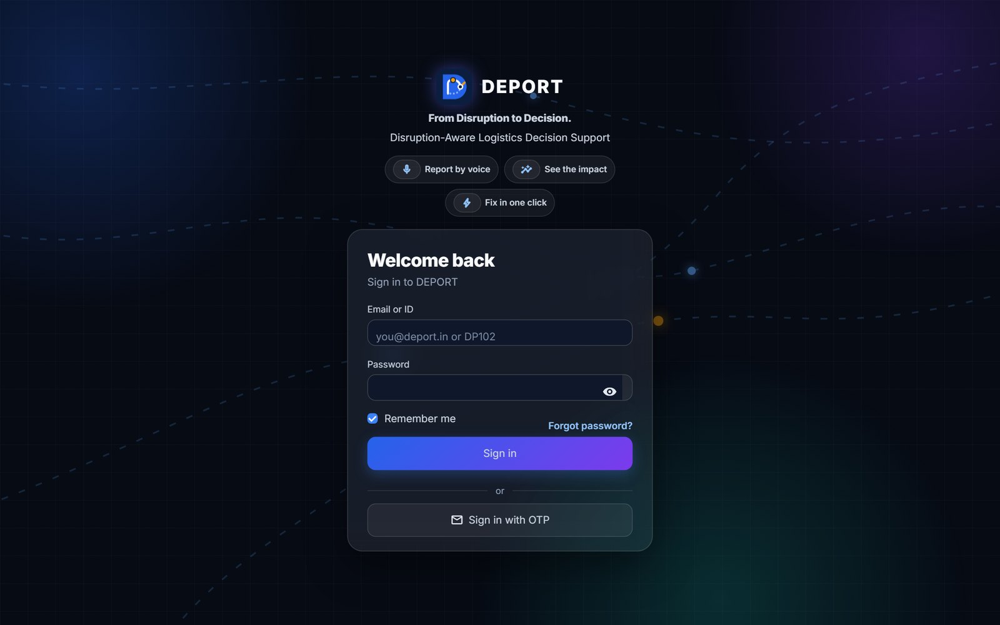
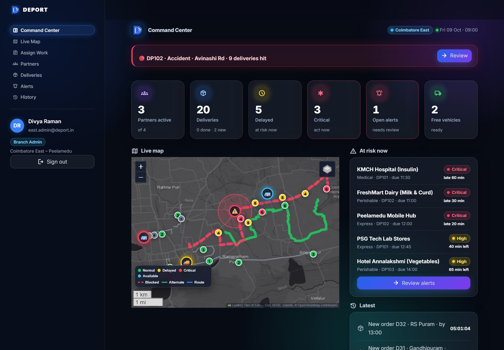
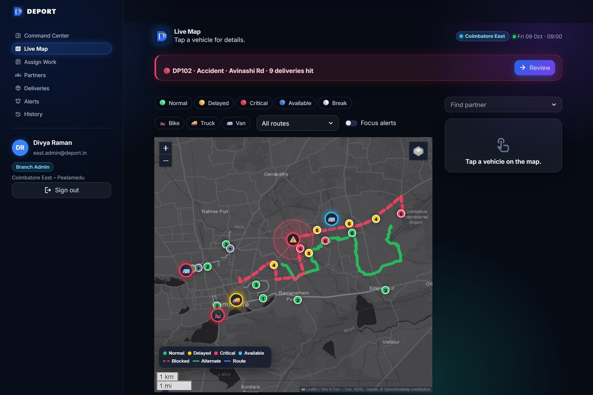
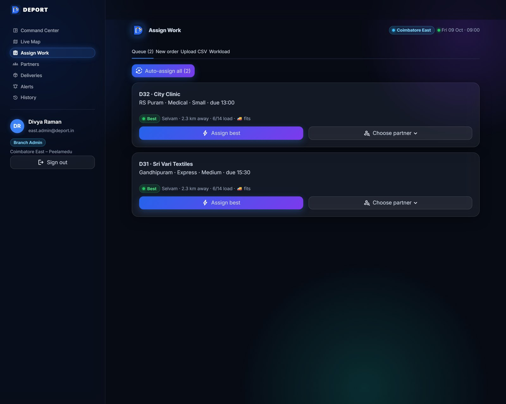
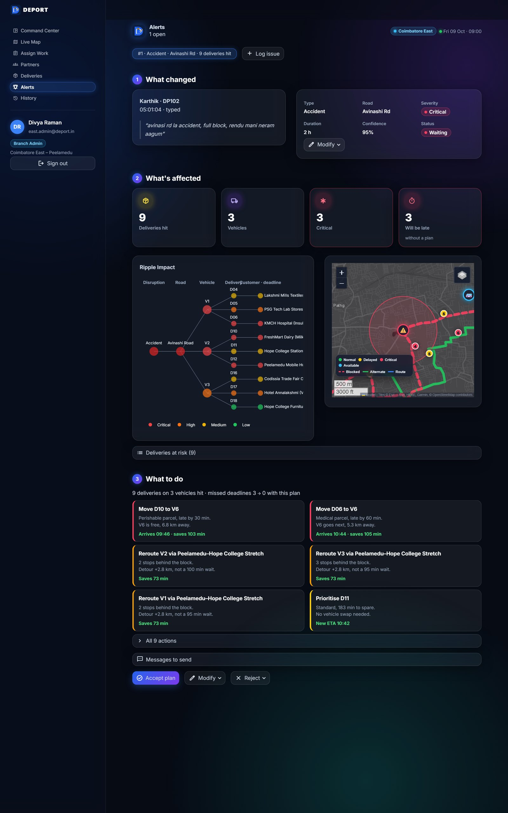
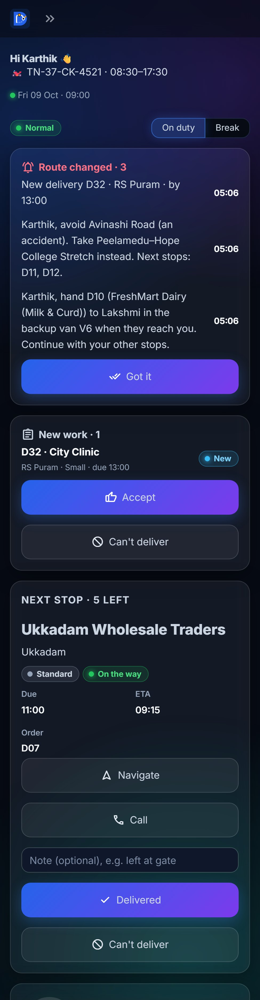
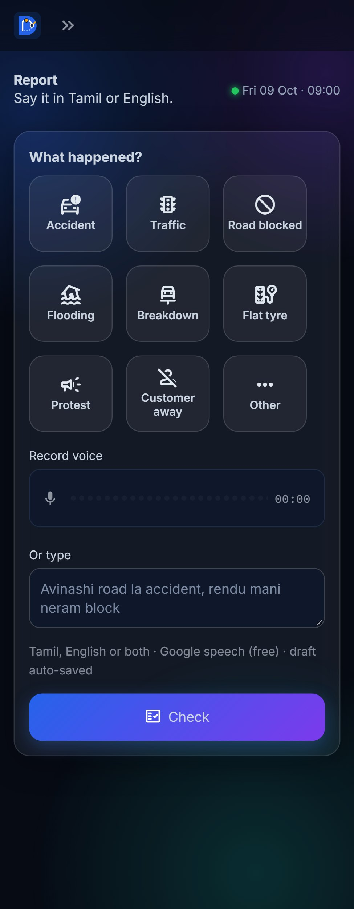
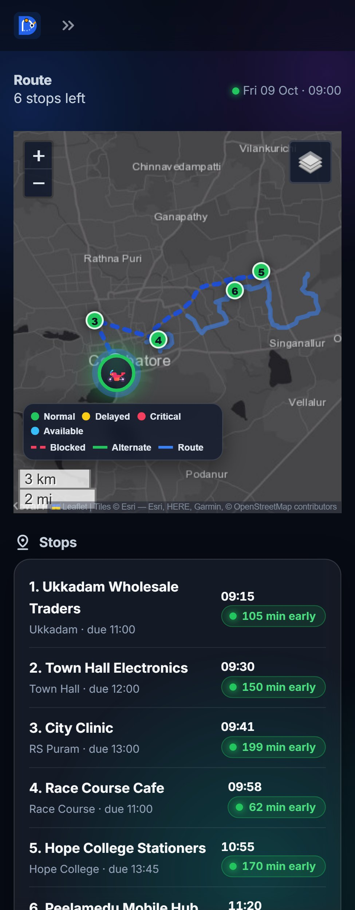

# DEPORT – Disruption-Aware Logistics Decision Support System

> **From Disruption to Decision.**

**Live demo:** <https://ripple-coimbatore.streamlit.app> · built for HackNext'26 (Coimbatore)

| Sign-in | Command Center (branch admin) |
|---|---|
|  |  |
| **Live Map** | **Assign Work** |
|  |  |

| Alerts – 3 steps | Partner: Today | Partner: Report | Partner: Route |
|---|---|---|---|
|  |  |  |  |

**Presentation:** [slides (PowerPoint)](docs/presentation/DEPORT_Presentation.pptx) ·
[presentation script & viva guide (Word)](docs/presentation/DEPORT_Presentation_Script_and_Viva.docx)

## What DEPORT does
1. **Report by voice** – a delivery partner taps *Accident* or says *"Avinashi road la accident, full block,
   rendu mani neram"* (Tamil, English or both). DEPORT finds the place even when misspelled.
2. **See the impact** – the branch admin gets an alert in seconds: which deliveries are hit, which will be
   late, what is critical (the **Ripple Impact** graph and a live map on real roads).
3. **Fix in one click** – the AI plan (backup van, reroute, prioritise, notify) with a 2-line reason per action.
   **Accept plan** updates routes, vehicles, ETAs, the map, KPIs, history and every partner's phone at once.

Demo numbers (2-hour accident on Avinashi Road): **9 deliveries hit → missed deadlines 3 → 0**,
average delay +95 → +17 min, KMCH insulin delivered by the backup van at 10:44 (deadline 11:30).

## New in v3
- **Assign Work** – create orders (one by one with a place check + map pin, or CSV), see the best partner for
  each with a reason (*"Karthik · 0.4 km away · 6/8 load · 🏍️ fits"*), *Assign best*, *Choose partner*,
  *Auto-assign all* (respects capacity), reassign/unassign with a reason, workload bars.
  Partners get **New work** and step through **Accept → Picked up → Start → Delivered** (no skipping);
  *Can't deliver* opens Report already filled in.
- **Nothing is lost** – one database file at `data/deport.db`; drafts of reports (incl. voice notes in
  `data/voice/`) and filters survive refresh, sign-out and restarts; *Reset demo data* asks first and saves a
  backup to `data/backups/`.
- **No Ctrl+Enter** – every input has a visible button; one-line fields submit on Enter.
- **Dark glass UI** – frosted glass cards, soft gradient background, neon status colours, dark map.
- **Sign-in that always works** – real Google (when configured), OTP by email, Forgot password, optional
  *Quick demo access* for judges.

## Roles
| Role | Pages | Sees |
|---|---|---|
| Super Admin | Overview · Branches · Admins · Audit log | all branches, summary level |
| Branch Admin | Command Center · Live Map · Assign Work · Partners · Deliveries · Alerts · History | own branch only |
| Delivery Partner | Today · Deliveries · Route · Report · History | own data only |

The role comes from the account – everyone signs in on the same page and lands on their own dashboard.
Super Admins sign in only at the unlisted **`/console`** page (not linked anywhere).

## Demo logins
For judges and this README only – never shown in the app.

| Who | Email / ID | Password |
|---|---|---|
| Super Admin (at `/console`) | `superadmin@deport.in` | `Super@123` |
| Branch Admin – East | `east.admin@deport.in` | `Admin@123` |
| Branch Admin – Central / South | `central.admin@deport.in` / `south.admin@deport.in` | `Admin@123` |
| Delivery Partner | `DP101`…`DP106` or `dp102@deport.in` (DP102 = Karthik, DP106 = Lakshmi, backup van) | `Partner@123` |

Also: **Sign in with OTP** (code by email, or on screen labelled DEMO when SMTP isn't set) and
**Forgot password?**. With `DEMO_MODE = "true"` the sign-in page shows **Quick demo access** chips
(Branch Admin, Delivery Partner DP102; Super Admin on `/console`) – off by default, keep it off in production.
*Reset demo data* (Super Admin sidebar, with confirm) restores the 09:00 state after saving a backup.

## Demo script (6 steps)
1. **Phone:** sign in as `DP102` → **Report** → tap *Accident*, record or type
   *"avinashi road accident, full block, 2 hours"* → **Check** → *We understood: Accident · Avinashi Road* → **Send**.
2. **Laptop:** sign in as `east.admin@deport.in` → Command Center shows the red banner
   *DP102 · Accident · Avinashi Rd · 9 deliveries hit* and *Critical 3*.
3. **Live Map** → DP102 pulses red on Avinashi Road (red dashed), green alternate route, tap the bike for the panel.
4. **Alerts** → ① what changed (transcript) ② what's affected (Ripple Impact, mini map) ③ what to do → **Accept plan**.
5. Green **Plan applied.** with Before → After (missed 3 → 0); KPIs, map and History update.
6. **Phone:** DP102's Today shows **Route changed** (avoid Avinashi Road); `DP106` now has the KMCH insulin pickup.
7. *Bonus – Assign Work:* **New order** "Sri Vari Textiles · gandhipuram" → *Check place* (pin) → *Save order* →
   **Assign best** → the partner sees **New work** → *Accept* → *Picked up* → *Start* → *Delivered*.

## Run it
```bash
pip install -r requirements.txt
streamlit run app.py                 # http://localhost:8501  (Super Admin: http://localhost:8501/console)
python -m pytest -q                  # no internet or keys needed
uvicorn api.main:app --reload        # REST API for a native app, docs at http://localhost:8000/docs
python scripts/build_geometry.py     # optional: refresh the cached real-road shapes from OSRM
```
Optional secrets (AI key, SMTP, Google sign-in, DEMO_MODE): copy `.streamlit/secrets.toml.example` to
`.streamlit/secrets.toml` (git-ignored; never commit it).

**Data is persistent locally:** everything lives in `data/deport.db` (plus `data/voice/`, `data/backups/`) and
survives sign-out, closing the browser and restarting the app. **Streamlit Community Cloud storage is temporary**
(wiped when the app sleeps, restarts or redeploys) – for a real deployment use a host with a persistent disk
(e.g. Render or Railway with a mounted volume, `DEPORT_DB=/data/deport.db`).

## Google sign-in setup (5 steps)
1. Google Cloud Console → *APIs & Services* → *Credentials* → **Create OAuth client ID** (Web application).
2. Authorised redirect URI: `<app URL>/oauth2callback` (e.g. `http://localhost:8501/oauth2callback`).
3. In `.streamlit/secrets.toml`: `[auth]` `redirect_uri`, `cookie_secret`; `[auth.google]` `client_id`,
   `client_secret`, `server_metadata_url = "https://accounts.google.com/.well-known/openid-configuration"`.
4. Restart – **Continue with Google** appears (Streamlit's real `st.login`; `Authlib` is in requirements).
5. Only emails of active DEPORT accounts get in (Branch Admins can set a partner's email via *Link Google*);
   others see "No DEPORT account for this email.". Not configured → the button is hidden.

## OTP by email (SMTP)
Set `SMTP_HOST` (`smtp.gmail.com`), `SMTP_PORT` (`587`), `SMTP_USER`, `SMTP_PASSWORD` (a Gmail **app password**:
Google Account → Security → 2-Step Verification → App passwords) and optionally `SMTP_FROM` in secrets.
Codes then go to the account's email; without SMTP they appear on screen labelled DEMO.

## How it works
- **Impact → risk → plan:** impact cascade over each vehicle's route, a 0–100 risk score (deadline, priority,
  closeness, severity), then backup van for urgent medical/perishable stops, reroute via the best open road, etc.
- **One transaction:** accepting a plan writes deliveries, routes, messages, the road block, the alert and the
  history in a single SQLite transaction – all or nothing. Every screen reads SQLite (no page copies) and refreshes
  within 4 s when anything changes.
- **Real roads, no network at demo time:** road shapes, vehicle road-snaps and driving legs come from the free
  OSRM server once (`scripts/build_geometry.py`), are committed in `data/route_geometry.json` and loaded into
  SQLite at seed. Basemap: Esri Dark Gray (keyless; layers: Street, OpenStreetMap, Satellite).
- **Assignment score** (lower is better): km from the partner's position/stops + load share − same-route bonus,
  big penalty if the deadline can't be met; only partners whose vehicle fits the package (bike = small) and who are
  not critical, on break or off. Insert position = cheapest detour; later stops' ETAs move by that detour.

## Security & data isolation
PBKDF2-SHA256 (200 000 iterations) passwords; session tokens and OTPs stored only as hashes; 5 wrong tries lock an
account for 2 minutes; *Remember me* = 7-day revocable session cookie; audit log of sign-ins and admin actions.
Role, branch and partner ID come only from the validated session. Branch scoping is enforced in the core code
(`modules/store.py`, `partner_scope.py`, `operations.py`), not just the UI – cross-branch writes raise
`PermissionError`, and every page checks the role first.

## Project structure
```
app.py            sign-in first, then role navigation          views/login.py · views/console.py
views/manager/    branch admin pages                            views/partner/ · views/super/
modules/          store (SQLite) · auth · guards · operations · impact · risk · recommender · parser · voice
                  assign (work assignment) · mailer (SMTP) · live_map · geometry (OSRM cache) · ui (design system)
                  manager_ui · partner_ui · report_ui · login_ui
assets/           style.css · logo.svg · logo_mark.svg · favicon.png
data/             branches, roads, vehicles, deliveries, partners, places (real Coimbatore coordinates), route_geometry.json
tests/            test_demo_flow · test_rbac · test_ui_data · test_persistence · test_assignment · test_auth_google
                  test_app_ui (headless click-through) · API · scenario
```

## Known limits
Routing is simplified to named roads (no live traffic); Google sign-in and SMTP need your own keys; Streamlit Cloud
storage is temporary (use a persistent disk to deploy); CARTO basemaps (Dark Matter, Voyager) now need an API key, so
the maps use Esri tiles; search boxes filter on Enter (Streamlit has no per-keystroke text input).
