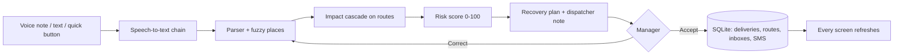

# Ripple – disruption-aware delivery operations

> Every disruption creates a ripple. Ripple shows how far it spreads – and how to stop it.

**Live demo:** <https://ripple-coimbatore.streamlit.app> ·
partner phone link: <https://ripple-coimbatore.streamlit.app/partner?id=P1> (Murugan) ·
free hosting – if it says the app is asleep, wake it and wait about a minute.

## The problem
A single accident, flood or flat tyre in a city like Coimbatore quietly breaks dozens of delivery
promises. Drivers phone the office, the dispatcher pieces together *where* it is and *which*
parcels are now late, and by the time anyone decides, the insulin for the hospital is an hour late
and the milk has spoiled. The information exists – it is just stuck in a driver's voice note.

## What Ripple does
| | Who | What happens |
|---|---|---|
| 1 | **Delivery partner** (phone) | Taps *Report a problem* and says it the way they talk: *"avinasi rd la accident, full block, rendu mani neram"*. |
| 2 | **AI** | Transcribes (Tamil/English/Tanglish), finds the place even when misspelled, works out every delivery that will be late, scores the risk and drafts a recovery plan – explained like a senior dispatcher would. |
| 3 | **Manager** (laptop or phone) | Sees the issue live on the map within seconds, reads the plan, taps **Accept**. |
| 4 | **Everyone** | Routes, ETAs and the backup van update instantly; each partner's phone gets its instructions; customer SMS are drafted. |

Demo numbers (2-hour accident on Avinashi Road): **9 deliveries on 3 vehicles hit → missed
deadlines 3 → 0, delay 855 → 154 min**, insulin for KMCH delivered by the backup van at 10:44
(deadline 11:30).

## 3-minute demo script (two devices)
1. **Laptop:** open *Operations* – live map of Coimbatore, 5 partners on duty, 30 deliveries, 0 issues.
2. **Phone:** open the partner link for **Murugan (P1)** → *Report a problem* → record
   *"Avinashi road la accident, full block, rendu mani neram aagum"* (or type it) → *Check* →
   "Accident · Avinashi Road · about 2 h · critical" → **Send to manager**.
3. **Laptop (within ~4 s):** banner "1 issue waiting for your decision" → *Review*. Show the voice
   note, transcript, what the AI understood, the impact (3 → 0 missed deadlines) and the dispatcher
   note. Open *Deliveries at risk, map and how the delay spreads*.
4. Tap **Accept plan** → KPIs update ("Deadlines saved: 3"), the map shows the detour in green.
5. **Phone:** Murugan sees "hand D06 to Lakshmi" and the detour. Switch to **Lakshmi (P6)** – the
   standby van now has the insulin and dairy pickups. Tap *Delivered*.
6. Bonus: tap any partner on the map for their details; search and download the team spreadsheet;
   type a misspelled place ("pelamedu", "R.S.Puram", "அவிநாசி சாலை") – it still works.
7. Before the next run: *Operations → Activity → Reset demo*.

## Features
**Operations (manager)**
- KPI tiles, live map (tap a partner → popup + detail panel with phone, shift, deliveries, stops)
- Team spreadsheet below the map: search, filter by status, select a row, download CSV
- Issues inbox with voice-note player, transcript, AI understanding + confidence, impact,
  dispatcher note, actions with reasons, **Accept / Correct it / Reject**, risk table, ripple map,
  dependency graph, message preview
- Deliveries table with changes (reassigned / rerouted / re-attempt), customer SMS outbox,
  activity log, one-click demo reset, *Log an issue* for problems heard by phone

**Partner app (phone first)**
- Next stop card with *Delivered* and *Call*, my stops, my reports with live status
- Report by quick button, voice note or text; "We understood …" check before sending;
  if no place is recognised, tap one of *your own* roads
- Messages from operations with *Got it*; on duty / on break / standby

**AI that degrades gracefully**
| Step | With a key | Without any key |
|---|---|---|
| Voice → text | Groq Whisper (Tamil/Tanglish) or Gemini | free Google web speech → else type one line |
| Text → problem | LLM extraction, validated | rules + Tanglish/Tamil keywords + spoken numbers |
| Place matching | – | fuzzy matching of 41 places, aliases and Tamil names (always on) |
| Plan | same engine | impact cascade + weighted risk + recommender |
| Explanation | LLM polishes the dispatcher note (numbers verified) | template note |

## How it works

- **Impact:** a delivery is hit if its vehicle's route reaches the blocked road before the stop;
  delay = detour/wait for the severity + a cascade per later stop; several disruptions add up.
- **Risk:** 45 × deadline pressure + 30 × priority (medical > perishable > express > standard)
  + 10 × closeness to the block + 15 × severity → Critical ≥ 75, High ≥ 50, Medium ≥ 25.
- **Plan:** urgent medical/perishable → nearest idle backup van (if it beats the deadline);
  other Critical/High → reroute via the best open road (never through another blocked road);
  Medium → prioritise; Low → notify the customer.
- **Live:** every write bumps a version number; each open screen checks it every 4 s and refreshes.

## Run it
```bash
pip install -r requirements.txt
streamlit run app.py                 # app on http://localhost:8501
uvicorn api.main:app --reload        # mobile API, docs on http://localhost:8000/docs
python -m pytest -q                  # 72 tests, no internet or keys needed
```
**Optional AI key (recommended for voice):** get a free key at <https://console.groq.com/keys>,
copy `.streamlit/secrets.toml.example` to `.streamlit/secrets.toml` and paste it there
(that file is git-ignored). On Streamlit Cloud paste the same line under *App → Settings → Secrets*.

## Mobile app plan
The Streamlit app is already phone-first (one-thumb buttons, no hover-only information,
light/dark theme, deep links per partner). For a native Android/iOS app (Flutter or React Native),
all business logic is in `modules/` (no UI code) and exposed by `api/main.py`:
`GET /partners/{id}`, `POST /issues/voice`, `POST /issues/{id}/accept`, `GET /map`, … – the
same database, so the native app and the web console can run side by side.

## Project structure
```
app.py                 navigation (Home · Operations · Partner app), theme
views/                 home.py · manager.py · partner.py
modules/
  store.py             shared live data (SQLite) – partners, deliveries, issues, messages, events
  places.py            fuzzy place matching (typos, no spaces, short forms, Tamil)
  parser.py            text → disruption (rules, Tanglish, optional LLM)
  voice.py             speech-to-text chain
  issues.py            report → structured problem
  impact.py · risk.py · recommender.py   the ripple model and the plan
  operations.py        analyse / dispatcher note / accept / reject / KPIs
  live_map.py · graph_viz.py             map and dependency graph
  ui.py · report_ui.py                   shared UI components
api/main.py            REST API for the native app
data/                  roads, vehicles, deliveries, partners, places (real Coimbatore coordinates)
tests/                 scenario, places, issue flow, API and UI click-through tests
docs/RIPPLE_V2_PROMPT.md   the build prompt, incl. the team's own words
```

## Questions judges ask
- **Does it scale?** SQLite → Postgres is a connection change; the API is stateless; a plan for
  30 stops takes milliseconds and grows linearly with the affected stops.
- **What if the AI is wrong?** Nothing changes until a human taps Accept; *Correct it* edits the
  problem and re-plans; every number in an AI-written note is checked against the template.
- **Real roads?** Real Coimbatore roads and places with real coordinates; routing is simplified to
  named road segments (no live traffic feed) – plugging in a routing API is the next step.
- **Privacy?** Voice notes stay in your own database; with no keys nothing leaves the server except
  the free speech fallback. Real authentication is needed before production (the demo has a role picker).

## Team module ownership
| Member | Owns |
|---|---|
| Member 1 | `data/`, `places.py`, `parser.py`, `voice.py`, `issues.py` (what changed) |
| Member 2 | `impact.py`, `risk.py`, `recommender.py`, `operations.py`, `api/` (what is affected / what next) |
| Member 3 | `app.py`, `views/`, `ui.py`, `report_ui.py`, `live_map.py`, `assets/style.css` (UI & visuals) |
