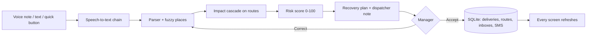

# Ripple – disruption-aware delivery operations

> Every disruption creates a ripple. Ripple shows how far it spreads – and how to stop it.

**Live demo:** <https://ripple-coimbatore.streamlit.app> – sign in as a manager on a laptop and as a
delivery partner on a phone (credentials below). Free hosting: if it says the app is asleep, wake it
and wait about a minute.

## The problem
A single accident, flood or flat tyre in a city like Coimbatore quietly breaks dozens of delivery
promises. Drivers phone the office, the dispatcher pieces together *where* it is and *which*
parcels are now late, and by the time anyone decides, the insulin for the hospital is an hour late
and the milk has spoiled. The information exists – it is just stuck in a driver's voice note.

## What Ripple does
| | Who | What happens |
|---|---|---|
| 1 | **Delivery partner** (phone) | Taps *Report a problem* and says it the way they talk: *"avinasi rd la accident, full block, rendu mani neram"*. |
| 2 | **AI** | Transcribes (Tamil/English/Tanglish), finds the place even when misspelled, works out every delivery that will be late, scores the risk and drafts a recovery plan – explained like a senior dispatcher would. |
| 3 | **Manager** (laptop or phone) | Sees the issue live on the map within seconds, reads the plan, taps **Accept**. |
| 4 | **Everyone** | Routes, ETAs and the backup van update instantly; each partner's phone gets its instructions; customer SMS are drafted. |

Demo numbers (2-hour accident on Avinashi Road): **9 deliveries on 3 vehicles hit → missed
deadlines 3 → 0, delay 855 → 154 min**, insulin for KMCH delivered by the backup van at 10:44
(deadline 11:30).

## Login & roles
The app opens on a sign-in page – nothing else (no menu, data, KPIs or map) is shown before login.
Choose **Manager** or **Delivery Partner**, then ID and password. After login you only get the pages
of your role:

| Role | Pages |
|---|---|
| Manager | Command Center · Map & Operations · Delivery Partners · Deliveries · Disruptions & AI · History |
| Delivery Partner | Today · My Deliveries · Report Issue · My History (own data only) |

### Demo credentials
| Role | ID | Password |
|---|---|---|
| Manager | `manager` | `ripple@123` |
| Delivery Partner | `DP101` … `DP106` (e.g. `DP102` = Karthik, `DP106` = Lakshmi, backup van) | `partner@123` |

IDs are not case-sensitive and spaces are ignored (`dp102`, ` DP102 ` work). Passwords are stored only
as PBKDF2-SHA256 hashes (100 000 iterations, own salt per account); 5 wrong attempts lock an ID for
60 seconds. *Reset demo data* (managers only, in the sidebar) restores all accounts.

### How partner data is isolated
A partner's identity comes only from the login session (or the API token) – never from a form, URL or
selectbox. Partner pages read and write exclusively through `modules/partner_scope.py`, whose functions
take that `dp_id` and touch only the partner's own rows in SQL (deliveries joined on the partner's own
vehicle, own messages, own reports). Writes such as *Delivered* check ownership in the `WHERE` clause and
raise `PermissionError` for anyone else's delivery; reports are always filed as the logged-in partner.
Every page also calls `require_role(...)` first, so a page reached directly shows "Access denied".

## 3-minute demo script
1. **Home** – the sign-in page (no data visible).
2. **Phone:** sign in as **Delivery Partner `DP102`** (Karthik) → *Report Issue* → record
   *"Avinashi road la accident, full block, rendu mani neram aagum"* (or type it) → *Check* →
   "Accident · Avinashi Road · about 2 h · critical" → **Send to manager** → *Logout*.
3. **Laptop:** sign in as **Manager** → *Command Center* shows "1 issue waiting for your decision" and the
   critical deliveries (KMCH insulin, FreshMart dairy).
4. *Map & Operations* – the blocked road, the ripple, tap a partner for details.
5. *Disruptions & AI* – voice note, transcript, what the AI understood, impact (missed deadlines 3 → 0)
   and the dispatcher note → **Accept plan** → KPIs update ("Deadlines saved: 3") → *Logout*.
6. **Phone:** sign in as **`DP102`** again → *Today* shows the new instructions (avoid Avinashi Road, take
   the Peelamedu–Hope College stretch, hand the dairy to Lakshmi) and *My Deliveries* is updated.
   Bonus: sign in as **`DP106`** (Lakshmi) – the backup van now has the insulin and dairy pickups.
7. Before the next run: sidebar → *Reset demo data* (manager).

## Features
**Manager**
- *Command Center*: KPI tiles, decision alert, deliveries at risk, delivery partner status, latest activity
- *Map & Operations*: live map – tap a delivery partner → popup + detail panel (phone, shift, stops)
- *Delivery Partners*: spreadsheet with search, status filter, row selection and CSV download
- *Disruptions & AI*: voice-note player, transcript, AI understanding + confidence, impact, dispatcher
  note, actions with reasons, **Accept / Correct it / Reject**, risk table, ripple map, dependency graph,
  message preview, *Log an issue* for problems heard by phone
- *Deliveries*: every order with changes (reassigned / rerouted / re-attempt) and the customer SMS outbox
- *History*: decided issues, activity log, AI status line

**Delivery Partner (phone first)**
- *Today*: "Hi Karthik 👋", new instructions with *Got it*, progress, next stop with *Delivered* and *Call*
- *My Deliveries*: own route on a map and all own stops
- *Report Issue*: quick button, voice note or text; "We understood …" check before sending; if no place
  is recognised, tap one of *your own* roads
- *My History*: own reports with status, instructions received, completed deliveries

**AI that degrades gracefully**
| Step | With a key | Without any key |
|---|---|---|
| Voice → text | Groq Whisper (Tamil/Tanglish) or Gemini | free Google web speech → else type one line |
| Text → problem | LLM extraction, validated | rules + Tanglish/Tamil keywords + spoken numbers |
| Place matching | – | fuzzy matching of 41 places, aliases and Tamil names (always on) |
| Plan | same engine | impact cascade + weighted risk + recommender |
| Explanation | LLM polishes the dispatcher note (numbers verified) | template note |

## How it works

- **Impact:** a delivery is hit if its vehicle's route reaches the blocked road before the stop;
  delay = detour/wait for the severity + a cascade per later stop; several disruptions add up.
- **Risk:** 45 × deadline pressure + 30 × priority (medical > perishable > express > standard)
  + 10 × closeness to the block + 15 × severity → Critical ≥ 75, High ≥ 50, Medium ≥ 25.
- **Plan:** urgent medical/perishable → nearest idle backup van (if it beats the deadline);
  other Critical/High → reroute via the best open road (never through another blocked road);
  Medium → prioritise; Low → notify the customer.
- **Live:** every write bumps a version number; each open screen checks it every 4 s and refreshes.

## Run it
```bash
pip install -r requirements.txt
streamlit run app.py                 # app on http://localhost:8501
uvicorn api.main:app --reload        # mobile API, docs on http://localhost:8000/docs
python -m pytest -q                  # 101 tests, no internet or keys needed
```
**Optional AI key (recommended for voice):** get a free key at <https://console.groq.com/keys>,
copy `.streamlit/secrets.toml.example` to `.streamlit/secrets.toml` and paste it there
(that file is git-ignored). On Streamlit Cloud paste the same line under *App → Settings → Secrets*.

## Mobile app plan
The Streamlit app is already phone-first (one-thumb buttons, no hover-only information,
light/dark theme, deep links per partner). For a native Android/iOS app (Flutter or React Native),
all business logic is in `modules/` (no UI code) and exposed by `api/main.py` with token login:
`POST /login` returns a signed token (set `RIPPLE_SECRET_KEY` in production). Partner apps use
`/me`, `/me/deliveries`, `/me/issues/voice`, `/me/deliveries/{id}/delivered` – the partner ID comes
only from the token. Manager apps use `/kpis`, `/map`, `/issues`, `/issues/{id}/accept`, … – the same
database, so the native app and the web console can run side by side.

## Project structure
```
app.py                 sign-in first, then role-only navigation + sidebar (user, Logout)
views/home.py          sign-in page
views/manager/         command_center · map_ops · partners · deliveries · disruptions · history
views/partner/         today · my_deliveries · report_issue · my_history
modules/
  store.py             shared live data (SQLite) – partners, deliveries, issues, messages, users
  auth.py · security.py   login, PBKDF2 password hashes, lockout
  guards.py            require_role() for every page; session keys
  partner_scope.py     the ONLY data access for partner pages (own rows, ownership-checked writes)
  places.py            fuzzy place matching (typos, no spaces, short forms, Tamil)
  parser.py            text → disruption (rules, Tanglish, optional LLM)
  voice.py             speech-to-text chain
  issues.py            report → structured problem
  impact.py · risk.py · recommender.py   the ripple model and the plan
  operations.py        analyse / dispatcher note / accept / reject / KPIs
  live_map.py · graph_viz.py             map and dependency graph
  ui.py · report_ui.py · manager_ui.py   shared UI components
api/main.py            REST API for the native app
data/                  roads, vehicles, deliveries, partners, places (real Coimbatore coordinates)
tests/                 scenario, places, issue flow, auth, isolation, API and UI click-through tests
docs/RIPPLE_V2_PROMPT.md   the build prompt, incl. the team's own words
```

## Questions judges ask
- **Does it scale?** SQLite → Postgres is a connection change; the API is stateless; a plan for
  30 stops takes milliseconds and grows linearly with the affected stops.
- **What if the AI is wrong?** Nothing changes until a human taps Accept; *Correct it* edits the
  problem and re-plans; every number in an AI-written note is checked against the template.
- **Real roads?** Real Coimbatore roads and places with real coordinates; routing is simplified to
  named road segments (no live traffic feed) – plugging in a routing API is the next step.
- **Privacy?** Voice notes stay in your own database; with no keys nothing leaves the server except
  the free speech fallback. Logins use hashed passwords and lockout; for production add HTTPS-only
  deployment, password reset and per-company accounts.

## Team module ownership
| Member | Owns |
|---|---|
| Member 1 | `data/`, `places.py`, `parser.py`, `voice.py`, `issues.py` (what changed) |
| Member 2 | `impact.py`, `risk.py`, `recommender.py`, `operations.py`, `api/` (what is affected / what next) |
| Member 3 | `app.py`, `views/`, `ui.py`, `report_ui.py`, `live_map.py`, `assets/style.css` (UI & visuals) |
